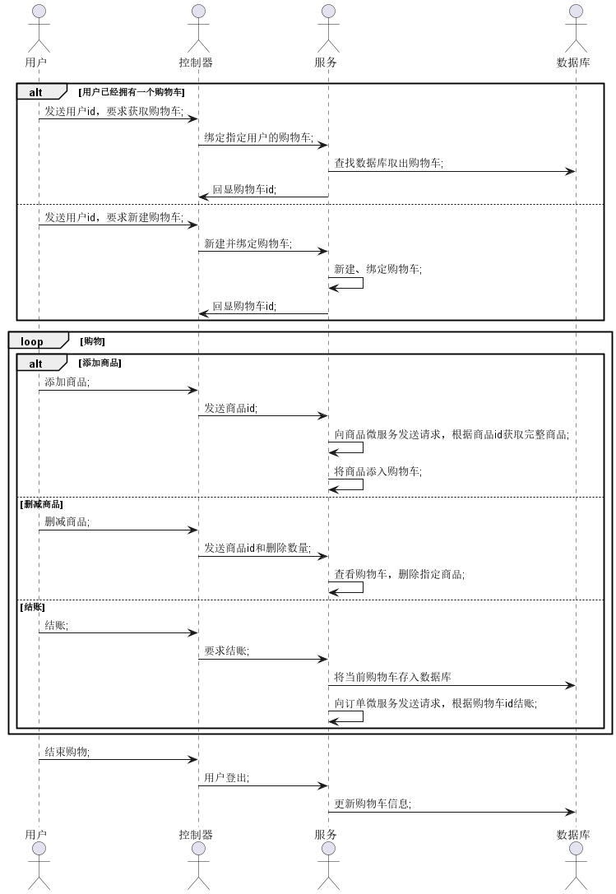
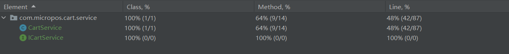
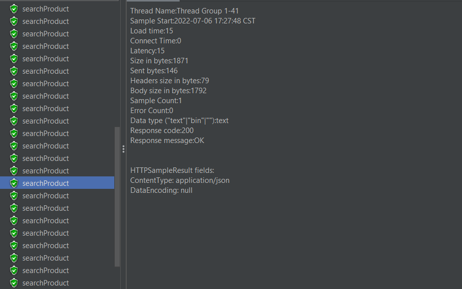

# aw10-final

| 学号      | 姓名   |
| --------- | ------ |
| 191220162 | 张乐简 |

[TOC]

## 概述

​		本实验基于Spring Webflux，完成了一个响应式的、5个微服务组成的购物系统。

## 代码结构

### DataLoader

​		同aw08一样，本实验中的商品数据利用Spring Batch存放在数据库里。

​		为方便更改数据结构，使用MongoDB。另一方面，由于Amazon提供的商品JSON中有大量不可用的数据和重复数据，该模块相比aw08在写入前添加了合法性判断，通过流处理滤去了不合理的数据。

```java
    @Override
    public void write(List<? extends JsonProduct> list) throws Exception {
        String regex="^.[0-9]+(\\.[0-9]+)?";
        Pattern r=Pattern.compile(regex);

        List<Product> products=list.stream()
                .filter(p->
                        !p.getAsin().isEmpty())
                .filter(p-> {
                            return !p.getPrice().isEmpty() && !p.getPrice().equals("") && p.getPrice().charAt(0) == '$' &&
                                    r.matcher(p.getPrice()).matches();
                        }
                )
                .filter(p->
                        p.getImageURLHighRes().size()>0)
                .map(p->
                        new Product(p.getAsin(),p.getTitle(),p.getPrice().substring(1),p.getImageURLHighRes().get(0)))
                .collect(Collectors.toList());

        for (Product product:
             products) {
            productInserter.insertProduct(product);
        }
    }
```

​		上述代码在ProductWriter.java中，其流程可以表示如下：


### 购物车微服务设计

​		购物车的业务逻辑如下：



​		注意到用户添加商品时微服务并不立刻将购物车信息存入数据库，而是暂时存在内存中，直到其他微服务需要或者用户登出时才进行数据库存取操作。考虑到购物车的体积不会太大，这样做可以有效节约响应时间。同时，这也使得购物车的ID和内容不必在每次通信时都出现，只需要在绑定时出现即可。

#### 访问其他微服务

​		通过WebClient访问微服务。

```java
@Component
public class CartWebClient {

    @Autowired
    Environment env;


    private WebClient cartClient;

    public CartWebClient(){
        cartClient=WebClient.builder().build();
    }

    public Flux<Product> getProducts(){
        return cartClient
                .get()
                .uri(env.getProperty("product.server")+env.getProperty("product.getProducts"))
                .accept(MediaType.APPLICATION_STREAM_JSON)
                .retrieve()
                .bodyToFlux(Product.class);
    }

    public Mono<Product> getProduct(String productId){
        return cartClient
                .get()
                .uri(env.getProperty("product.server")+env.getProperty("product.getProduct")+productId)
                .accept(MediaType.APPLICATION_JSON)
                .retrieve()
                .bodyToMono(Product.class);
    }

    public Mono<Order> checkOut(Cart cart){
        return cartClient
                .post()
                .uri(env.getProperty("delivery.server")+env.getProperty("delivery.checkout"))
                .header("id",cart.getId())
                .accept(MediaType.APPLICATION_JSON)
                .retrieve()
                .bodyToMono(Order.class);
    }
}

```

#### 异常处理

​		为了方便维护上述的流程，设计了三个异常用来描述购物车不正常访问的情况，如下：

```java
//一个用户只能拥有一个购物车。当他试图创建第二个购物车时，这个异常便会被抛出
public class CartDuplicateException extends RuntimeException{
    public CartDuplicateException(String usrId,String cartId){
        super(usrId+" already has a cart "+cartId);
    }
}
//购物车未在数据库中找到。
public class CartNotFoundException extends RuntimeException{
    public CartNotFoundException(){
        super("cart not found.");
    }
}
//Service层未绑定购物车。在任何对购物车操作前都需要绑定购物车。
public class CartNotRegisteredException extends RuntimeException {
    public CartNotRegisteredException() {
        super("Register a cart before doing any operation.");
    }
}
```

### 商品微服务设计

#### 分页

​		在DataLoader准备好数据的情况下，商品微服务的设计比较简单。为了支持商品分页机制，对DataLoader进行一定的修改：

```java
        List<Product> products=list.stream()
				...
                .map(p->{
                    ProductRepository.productCounter.getAndIncrement();
                    return new Product(p.getAsin(),p.getTitle(),p.getPrice().substring(1),p.getImageURLHighRes().get(0),ProductRepository.productCounter.get()/20+1);
                }
                )
                .collect(Collectors.toList());
```

​		如上，使用一个AtomicInteger作为计数器，为每个商品指定其页数。

#### 搜索

​		MongoDB支持正则表达式匹配，搜索功能就依赖于这种特性：

```java
    @Query(value = "{name:{$regex: ?0}}")
    List<Product> searchProductsByTitle(String title);
```

​		然后在Controller中将其转化为Flux。

```java
    @GetMapping("/products/search/{title}")
    public Flux<Product> searchProductByTitle(@PathVariable String title){
        List<Product> products=mongoDBProductRepository.searchProductsByTitle(title);
        return Flux.fromIterable(products);
    }
```

### 订单微服务设计

​		为做出区分，订单微服务不采用注释的方式实现Controller，而是采用Router+Handler的方式实现。

​		Router用于配置路由，如下：

```java
    @Bean
    public RouterFunction<ServerResponse> route(DeliveryHandler deliveryHandler) {
        String prefix = "/delivery";
        return RouterFunctions
                .route(POST(prefix +"/checkout").and(accept(APPLICATION_JSON)), deliveryHandler::checkout)
                .andRoute(GET(prefix +"/list/{id}").and(accept(APPLICATION_JSON)), deliveryHandler::listOrders);
    }
}
```

​	Handler则用于具体实现响应函数。

```java
    public Mono<ServerResponse> checkout(ServerRequest request){
        return ok()
                .build(deliveryService.checkoutCart(request.headers().header("id").get(0)));
    }

    public Mono<ServerResponse> listOrders(ServerRequest request) {
        return ok()
                .contentType(MediaType.APPLICATION_JSON)
                .bodyValue(deliveryService.listOrders(request.pathVariable("id")));
    }
```

​		另外，该部分的CartRepository采用ReactiveMongoRepository，因此存取数据时需要通过subscribe进行消费：

```java
    public Mono<Void> checkoutCart(String cartId){
        cartRepository.findById(cartId)
                .subscribe(
                        cart->{
                            System.out.println(1);
                            Order order=new Order(cart);
                            deliveryRepository.save(order);
                        }
                );
        return Mono.empty();
    }

```

### 网关设计

​		在网关处配置路由即可：

```yml
server:
  port: 8080
spring:
  application:
    name: pos-gateway
  cloud:
    gateway:
      routes:
        - id:
            pos-product
          uri:
            http://localhost:8082
          predicates:
            - Path=/product/products,/product/products/{page},/product/product/{id},/product/products/search/{title}
            - Method=GET

        - id:
            pos-cart-post
          uri:
            http://localhost:8081
          predicates:
            - Path=/cart/create/{usrId},/cart/select/usr/{usrId},/cart/select/cart/{cartId},/cart/checkout,/cart/logout,/cart/add/{productId}/{quantity}
            - Method=POST

        - id:
            pos-cart-get
          uri:
            http://localhost:8081
          predicates:
            - Path=/cart/list/{cartId},/cart/list
            - Method=GET

        - id:
            pos-cart-delete
          uri:
            http://localhost:8081
          predicates:
            - Path=/cart/item/{productId}/{quantity},/cart/item/{productId},/cart
            - Method=DELETE

        - id:
            pos-delivery-get
          uri:
            http://localhost:8083
          predicates:
            - Path=/delivery/list/{id}
            - Method=GET

        - id:
            pos-delivery-post
          uri:
            http://localhost:8083
          predicates:
            - Path=/delivery/checkout
            - Method=GET
```

## 测试

### 单元测试

​		为系统的必要函数编写单元测试。购物车微服务主要难点集中在Service层上，故在此处编写单元测试。



​		由于方法有很多是纯副作用函数，相对难以编写，该类方法覆盖率较低。接着，对订单微服务和商品微服务的全部API进行测试。测试途中，我发现由于MockMvc在spring-web依赖中，担心将其和spring-webflux同时加入项目会发生异常，因此采用别的方式进行Http测试，如下：

```java
//首先引入必要的依赖和注释
@WebFluxTest(controllers = DeliveryRouter.class)
@RunWith(SpringRunner.class)
@Import({TestCartRepo.class,TestDeliveryRepo.class, DeliveryService.class,DeliveryHandler.class})
class DeliveryHandlerTest 
...
//获取WebTestClient
@Autowired
WebTestClient testClient;
//用Mockito进行模拟
when(cartRepository.findById(Mockito.anyString()))
       .thenReturn(Mono.just(testCart));
testOrder=new Order(testCart);
List<Order> testOrders=new ArrayList<>();
testOrders.add(testOrder);
when(deliveryRepository.findByUsrId("testUsr"))
       .thenReturn(testOrders);
...
//利用WebTestClient进行测试 
@Test
void checkout() {
    testClient.post()
            .uri("/delivery/checkout")
            .header("id","123-cart")
            .exchange()
            .expectStatus()
            .isOk();
 }
```

​		由于这类测试方法要求所测Controller中的每一个Autowire属性都有一个非接口的实现，而MongoRepository仅有接口，因此必须自己实现一个借口然后用它填充，之后在实际测试中将其用模拟的方式取代掉。

​		测试覆盖率如下：


### 集成测试

​		使用Postman进行集成测试。

​		首先注册一个新购物车，获取购物车ID。


​		接着添加商品、删除商品，然后查看购物车情况。


​		


​		然后发出订单。

​		

​		接下来查看订单。


### 压力测试

​		使用jmeter进行压力测试，测试查看全部商品、根据名称搜索商品和添加货物三个功能的速度。

#### 20

​		首先使用20的并发量。


​		

​		如上图，由于商品数量较多，查看所有商品的Latency平均在约400ms。搜索商品的速度则要快得多，平均在20ms左右。


​		

​		添加物品的Latency最小，不超过10ms。

#### 50

​		当并发量达到50时，查看所有商品的Latency变得很长，在2秒左右。


​		

​		搜索商品的Latency方差较大，从15ms到2000ms都有。


​		添加新商品的Latency由于不涉及数据库操作依然很小，大部分在10ms以内。

#### 分页优势

​		由于获取全部商品需要的Latency太大，单独设计一个获取指定页数商品的API。其中，每页商品包含20个商品。这样一来，即使在50并发的情况下，Latency也可以控制在10~200ms之间：


## 


